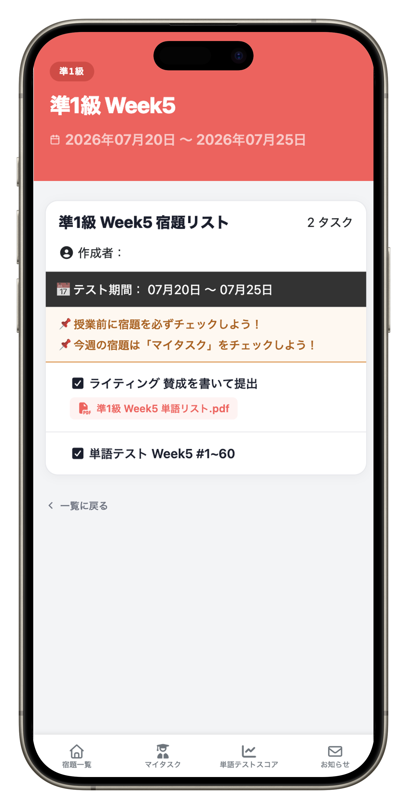
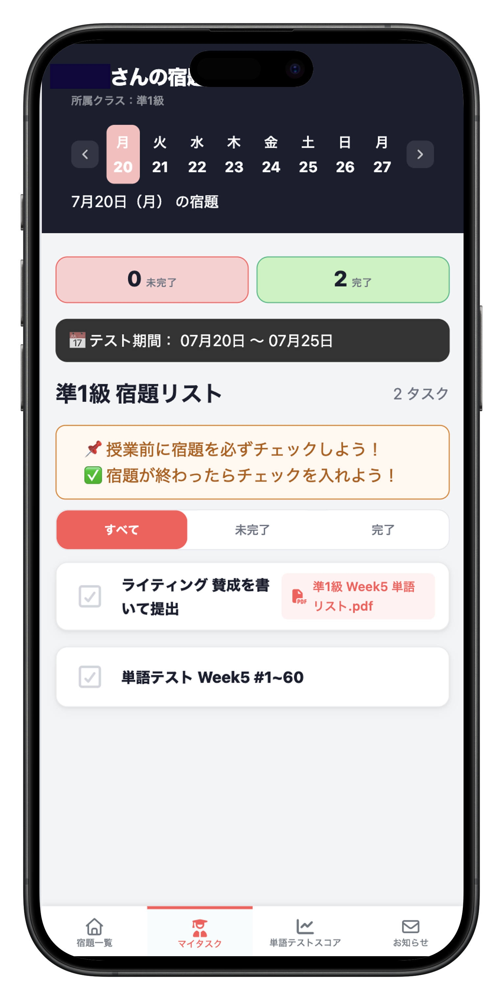
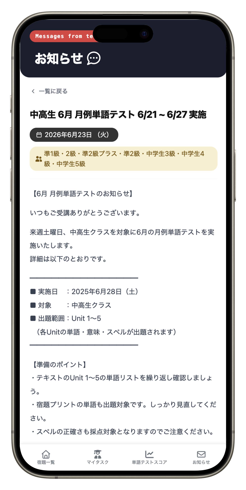
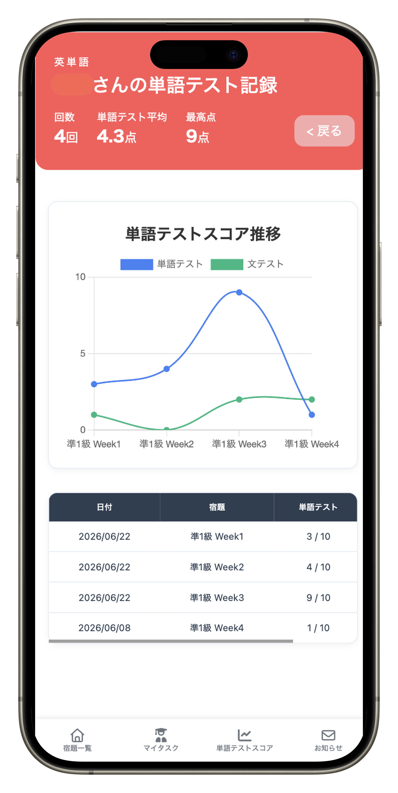
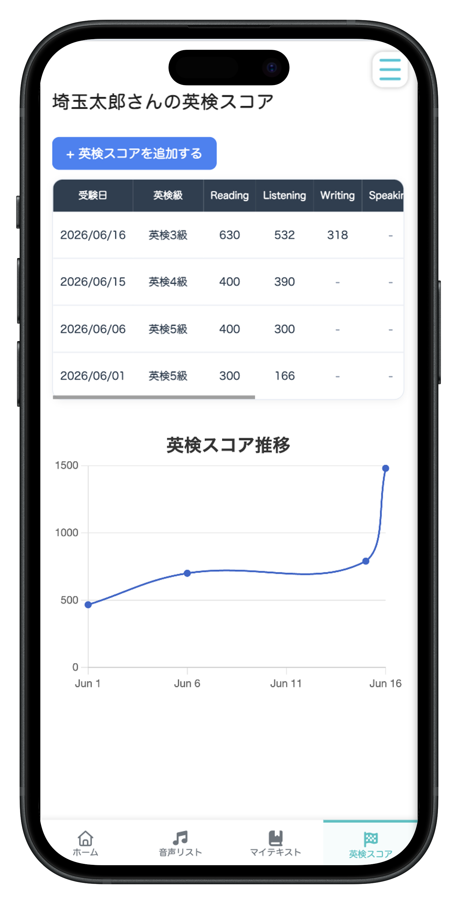
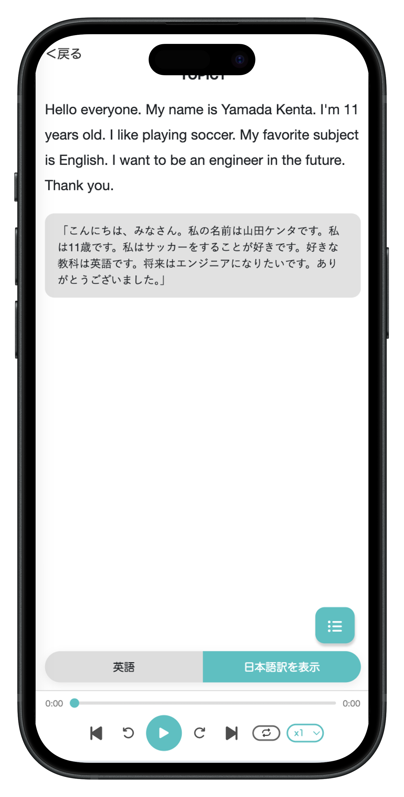
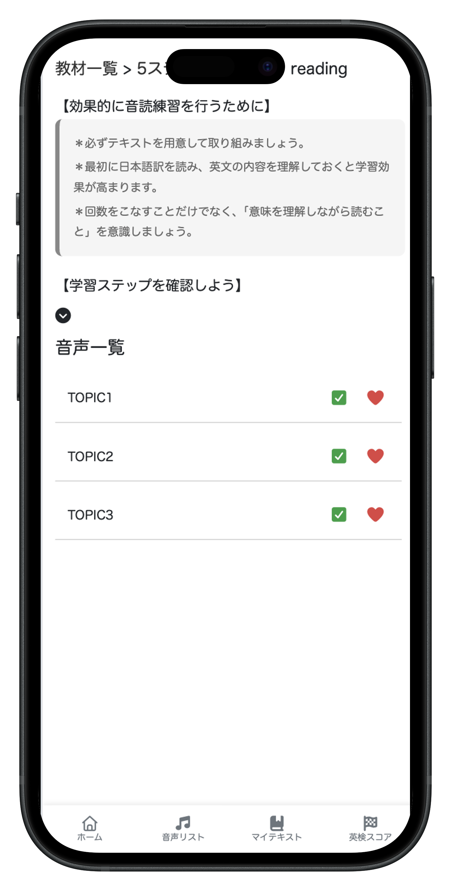

# Nice to meet you! 😎
Hi! 👋 My name is Kenta.
I'm a junior web developer based in Japan.

I graduated from an online programming school, RUNTEQ while working as an English teacher and enjoy building web applications with Ruby on Rails.

### Skill Set

## My side Projects
### [宿題管理アプリ What's My Homework?](https://whatsmyhomework.onrender.com/)

英会話スクールでは、生徒が欠席した際の宿題確認や、保護者からの問い合わせ対応、紙のプリント管理など、多くの業務が講師の負担となっていました。

本アプリは、こうした課題を解決するために開発した英会話スクール向けの宿題管理アプリです。生徒・保護者・講師が宿題やお知らせをオンラインで共有でき、より効率的な学習管理を実現します。

Github: [こちら](https://github.com/kentach/WhatsMyHomework)
テーブル設計・技術選定について: [こちら](https://note.com/kenta234/n/n06a74c22724d)

<table>
  <tr>
    <td align="center">
       
      宿題詳細
    </td>
    <td align="center">
       
      タスク管理
    </td>
    <td align="center">
       
      お知らせ
    </td>
    <td align="center">
       
      単語テスト記録
    </td>
  </tr>
</table>

### technology

--- 

### [英語音読トレーニングアプリ Listener](https://listener-2026.onrender.com/)

前職の英会話スクールで感じた「音声ダウンロードの不便さ」「単語に偏った学習」「音読学習の継続の難しさ」を解決するために開発した、英語音読トレーニングアプリです。

ユーザーがいつでも音読練習に取り組める環境を提供し、学習履歴や達成状況を可視化することで、継続的な英語学習をサポートします。

Github: [こちら](https://github.com/kentach/Listener)

<table>
  <tr>
    <td align="center">
       
      英検スコア記録
    </td>
    <td align="center">
       
      音読トレーニング
    </td>
    <td align="center">
       
      完了・お気に入り
    </td>
  </tr>
</table>

### technology

